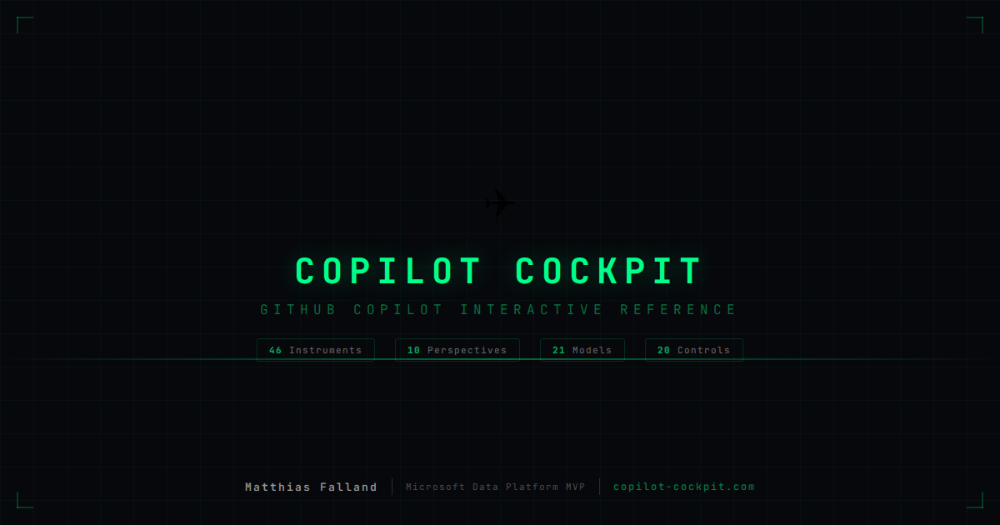

# Copilot Cockpit

**Interactive reference for GitHub Copilot** — 46 instruments across 10 perspectives, built with an aviation cockpit metaphor.

Live at [copilot-cockpit.com](https://copilot-cockpit.com)



## What is this?

Copilot Cockpit maps every GitHub Copilot feature onto an aircraft cockpit layout. Each feature is an "instrument" — grouped into zones, connected by wiring, governed by tower controls. The metaphor turns a sprawling product surface into something you can navigate at a glance.

This is not official GitHub documentation. It's an independent reference built from public sources, hands-on testing, and enterprise deployment experience.

## Perspectives

The site follows an airport journey — each perspective shows Copilot from a different angle:

| # | Perspective | What it covers |
|---|-------------|----------------|
| 1 | **Terminal** | Getting started — plan selection, IDE setup, first exercises |
| 2 | **Security** | CISO view — threat models, attack scenarios, compliance mapping |
| 3 | **Jet Bridge** | Prompt craft, context management, edit mode, agent patterns |
| 4 | **Ramp** | Agents & ground handling — MCP servers, custom agents, autonomous workflows |
| 5 | **Cockpit** | The main board — all 46 instruments on a HUD-style grid |
| 6 | **Runway** | AI model catalog — engine specs, topology, handover architecture |
| 7 | **Tower** | Admin & governance — policies, controls, sovereign cloud, data residency |

Plus three utility pages:

- **Flight Log** — Changelog tracking feature launches, upgrades, and incidents
- **Pre-Flight** — Interactive onboarding readiness checklist
- **Wiring Diagram** — Instrument connection graph (Mermaid-powered)

## Data

All content is data-driven from JSON files in `data/`:

| File | Contents |
|------|----------|
| `copilot-instruments.json` | 46 instruments with capabilities, zones, plans, status |
| `copilot-models.json` | 21 AI models with specs, benchmarks, provider info |
| `governance-controls.json` | 20 admin controls with compliance framework mappings |
| `sovereign-cloud.json` | Data residency, encryption, deployment options |
| `security-threats.json` | 22 threat models with attack scenarios and countermeasures |
| `security-frameworks.json` | OWASP LLM Top 10 + MITRE ATLAS cross-references |
| `known-changelog-entries.json` | 35 changelog entries |
| `wiring-diagram.json` | 55 instrument connections |

## Tech stack

- **Vanilla JS** — no framework, no build step, no bundler
- **CSS** — single `styles.css` with dark/light theme, HUD aesthetic
- **Mermaid v11** — topology diagrams, data flow charts, wiring graphs
- **Playwright** — 222 end-to-end tests
- **Vercel** — static hosting

## Running locally

```bash
# Serve with any static server
npx serve .

# Or use the Playwright dev server
npm test
```

## Tests

```bash
# Install Playwright (first time)
npx playwright install chromium

# Run all 222 tests
npm test

# Run a specific spec
npx playwright test tests/tower.spec.js
```

## Contributing

Feedback and contributions welcome. Open an [issue](https://github.com/TheTrustedAdvisor/copilot-cockpit/issues/new?labels=feedback&template=feedback.md) or submit a PR.

The data files are the easiest place to contribute — add missing instruments, update model specs, or correct governance control details.

## Author

**Matthias Falland**
Microsoft Data Platform MVP & The Trusted Advisor

- [LinkedIn](https://www.linkedin.com/in/matthias-falland)
- [Homepage](https://www.the-trusted-advisor.com/)
- [YouTube](https://www.youtube.com/@The-Trusted-Advisor)
- [GitHub](https://github.com/TheTrustedAdvisor)

## License

[MIT](LICENSE)
